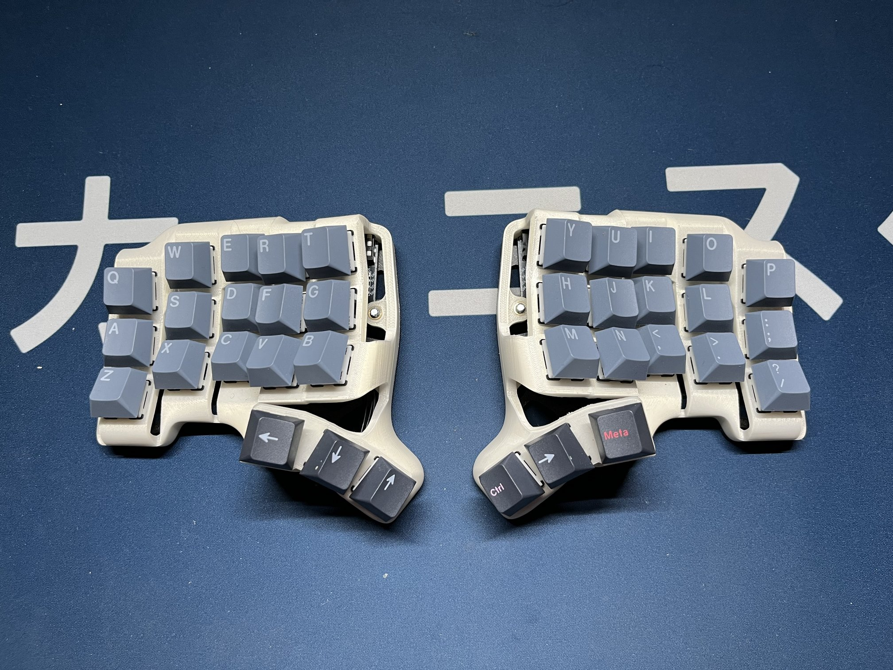
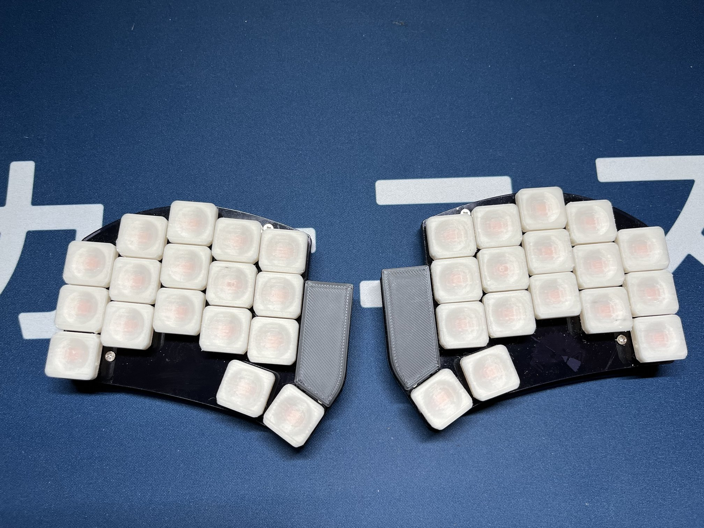

After almost two years using my BastardKB's Scylla ergodox keyboard, I decided it was time to go deeper into the split-ergo mechanical keyboard rabbit hole and upgrade it to even smaller Skeletyl keyboard. This new keyboard has only 36 keys and I built it using the provided open-sourced PCBs and case STLs. As for the switches, I decided to go with the low-cost Akko Penguin Silents, but these have been so far surprisingly good.

_My Skeletyl build with temporary GMK Nord keycaps and Akko Penguin Silent switches_

The reason for switching was that I had a suspicion that the switches I used started failing and I realized that I already hadn't used one entire column on each hand. Also I somehow managed to lose my QMK configs, so editing the current layout would require a lot of work that I didn't want to put into it.
The final reason for the switch was that I wanted to explore some of QMK's features and possibilities including numpad-like number entry, caps-word and mouse-keys simple mouse use when travelling.

Once I built the Skeletyl and validated that typing on it was indeed possible and even good, I decided that I wanted to build a keyboard for travelling. I chose the Ferris Sweep Blinq LP, because it was easily obtainable via [42keebs](http://42keebs.eu). 


_My Ferris Sweep build with 3D printed choc keycaps and Choc Sunset switches_

I knew that I wanted to share as much of the keymaps/configuration/firmware as possible to avoid having to think about two different keymaps for similar keyboard, so once I had both keyboards up and running the default keymap, I started to tinker with ways to share keymap between them.

Sharing a keymap has a few problems:

* the keyboards have a different number of keys (36 keys for the Skeletyl and 34 keys for the Sweep)
* the keyboards use different MCU daughter boards and their matrix wiring is different, so couldn't get away with a single firmware
* I couldn't find any practical example of doing that step-by-step

I discovered [qmk-userspace](http://github.com/qmk/qmk_userspace) which solves the problem of having custom keymaps outside of the main QMK repository (a big leap forward since I last tinkered with QMK where every user was trying to upstream their keymaps) and also conveniently provides a way to build keyboard firmwares in CI. Meaning that wouldn't have to setup a new build environment if I wanted to make a quick keymap change.

It seemed however, that there was no way of sharing a keymap, but then I discovered that there is a mysterious `layouts` directory there and according to the [docs](https://docs.qmk.fm/feature_userspace) it should've been possible to use it to share keymaps. 
Unfortunately, the docs didn't go into much detail of how to achieve that.

So after some googling, prompting and banging my head against the wall, I did the following.

1. Create a flavour of the Ferris Sweep keyboard by copying `qmk_firmware/keyboards/ferris/sweep` to `qmk_firmware/keyboards/ferris/hati_sweep`
2. Change `hati_sweep`'s `keyboard.json` definition to support `split_3x5_3` layout used by the Skeletyl. This can be done by simply adding one more `null` to the last row of the matrix definitions and then modifying the supported layout, so that the extra key maps to the null matrix position.
   
```json
{
	// .. unchanged
	"matrix_pins": {
	    "direct": [
	        ["GP7",  "GP26", "GP27", "GP28", "GP29"],
	        ["GP22", "GP20", "GP23", "GP21", "GP0"],
		    ["GP2",  "GP3",  "GP4",  "GP5",  "GP6"],
	        ["GP8",  "GP9",  null,   null,   null]
	    ]
	},
	"split": {
	    "enabled": true,
	    "matrix_pins": {
			"right": {
			    "direct": [
			        ["GP29", "GP28", "GP27", "GP26", "GP7"],
		            ["GP0", "GP21", "GP23", "GP20", "GP22"],
		            ["GP6", "GP5", "GP4", "GP3", "GP2"],
		            [null, "GP9", "GP8", null, null]
		        ]
		    }
	    },
	}
	// .. unchanged
	"layouts": {
	    "LAYOUT_split_3x5_3": {
	        "layout": [
				// .. unchanged
	            {"x": 3.5, "y": 3.75, "matrix": [3, 0]},
	            {"x": 4.5, "y": 4, "matrix": [3, 1]},
				// .. added
	            {"x": 4.5, "y": 4, "matrix": [3, 2]},
	            {"x": 6.5, "y": 4, "matrix": [7, 0]},
	            {"x": 7.5, "y": 3.75, "matrix": [7, 1]},
				// .. added
	            {"x": 7.5, "y": 3.75, "matrix": [7, 2]}
	        ]
	    }
	}
}
```
_keyboard.json_

3. Create a new keymap in `qmk_userspace/layouts/split_3x5_3/hati` and include the keymap and shared definitions such as `rules.mk` and `config.h` containing common definitions for both keyboards e.g. mouse settings and enabling of features (combos, caps-word).
4. Flash the boards with the new shared keymap:
   `qmk flash -kb bastardkb/skeletyl/v2/keeboar -km hati` for skeletyl and
   `qmk flash -kb ferris/hati_sweep -km hati` for the sweep

Mission successful, now I can use a single keymap for both of the keyboards, with the same features enabled and thanks to the `qmk_userspace` repo and setup, I can simply push a change of the keymaps to the repository and CI will build it for me if I don't have the build environment ready locally.
The only thing left is for qmk to support out-of-tree keyboard definitions so that I can use upstream qmk and not have to vendor it myself with keyboard specific changes.
   
Both of the repositories can be found here: [qmk_firmware](https://github.com/matoushybl/qmk_firmware)
[qmk_userspace](https://github.com/matoushybl/qmk_userspace)